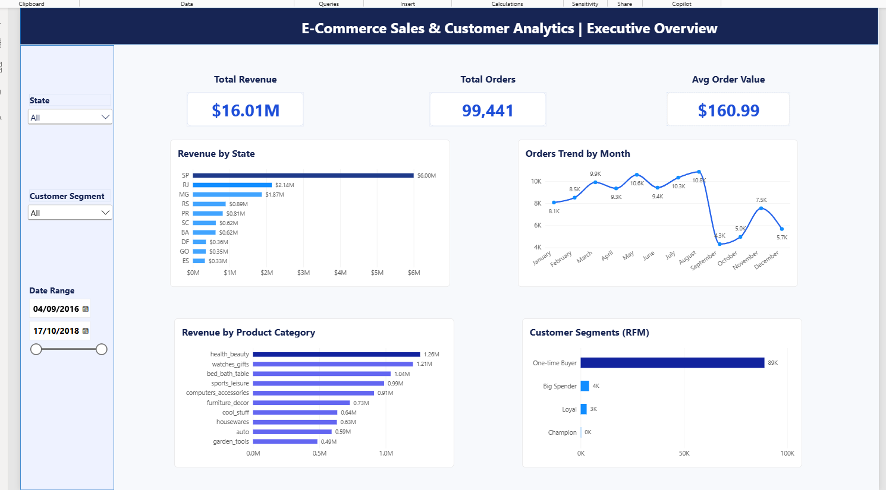

# E-Commerce Sales & Customer Analytics

An end-to-end data analytics project built on the **Olist Brazilian E-Commerce** dataset — covering data cleaning, SQL analysis, and an interactive Power BI dashboard.

## Business Overview

This project analyzes order, customer, and payment data from a Brazilian e-commerce marketplace to answer three core business questions:

1. Where does revenue actually come from, and is that the same as where the *best* customers are?
2. How healthy is the customer base — is growth coming from repeat buyers or one-time acquisition?
3. What does order volume look like over time, and where are the gaps in the data?

**Pipeline:** Excel → Google BigQuery (SQL) → Power BI

## Dataset

[Olist Brazilian E-Commerce Public Dataset](https://www.kaggle.com/datasets/olistbr/brazilian-ecommerce) (Kaggle) — 9 relational CSV files covering ~100,000 orders placed between 2016–2018: customers, orders, order items, payments, reviews, products, sellers, geolocation, and category translations.

## Process

### 1. Excel — Initial Exploration
- Explored raw tables to understand structure and grain (e.g. discovered `customer_id` is order-level while `customer_unique_id` is person-level)
- Verified referential integrity between `orders` and `customers` using VLOOKUP/COUNTIF
- Used PivotTables to establish baseline counts (96,096 unique customers across 99,441 orders)

### 2. Google BigQuery — Validation & SQL Analysis
- Loaded all 9 tables into BigQuery (Sandbox mode)
- **Data validation:** checked referential integrity, duplicate records, and invalid values (prices ≤ 0) across 112K+ line items — dataset was largely clean, with one cosmetic issue found (inconsistent city name casing)
- **Revenue analysis:** aggregated revenue and order counts by state
- **RFM segmentation:** built customer segments (Champion, Loyal, Big Spender, One-time Buyer) using Recency, Frequency, and Monetary value via SQL CTEs

### 3. Power BI — Interactive Dashboard
- Connected live to BigQuery, modeled relationships across all 7 core tables (star-schema style)
- Built calculated RFM segmentation table using DAX (`SUMMARIZECOLUMNS` + `ADDCOLUMNS` + `SWITCH`)
- Designed an Executive Overview dashboard with KPI cards, state-level breakdowns, category performance, monthly trend, and customer segmentation
- Added interactive slicers (State, Customer Segment, Date Range)

## SQL Scripts

### Data Validation

**Check for invalid prices**
```sql
SELECT
  COUNT(*) AS bad_price_count
FROM `ecommerce_raw.order_items`
WHERE price <= 0;
```

**Check for duplicate order items**
```sql
SELECT
  order_id,
  order_item_id,
  COUNT(*) AS row_count
FROM `ecommerce_raw.order_items`
GROUP BY order_id, order_item_id
HAVING COUNT(*) > 1;
```

**Validate order-to-customer relationship**
```sql
SELECT
  o.order_id,
  o.order_status,
  c.customer_city,
  c.customer_state
FROM `ecommerce_raw.orders` o
JOIN `ecommerce_raw.customers` c
  ON o.customer_id = c.customer_id
LIMIT 10;
```

### Revenue by State

```sql
SELECT
  c.customer_state,
  ROUND(SUM(p.payment_value), 2) AS total_revenue,
  COUNT(DISTINCT o.order_id) AS total_orders,
  ROUND(
    SUM(p.payment_value) / COUNT(DISTINCT o.order_id),
    2
  ) AS avg_order_value
FROM `ecommerce_raw.orders` o
JOIN `ecommerce_raw.customers` c
  ON o.customer_id = c.customer_id
JOIN `ecommerce_raw.order_payments` p
  ON o.order_id = p.order_id
GROUP BY c.customer_state
ORDER BY total_revenue DESC;
```

### RFM Segmentation

```sql
WITH rfm AS (
  SELECT
    c.customer_unique_id,
    DATE_DIFF(
      CURRENT_DATE(),
      MAX(DATE(o.order_purchase_timestamp)),
      DAY
    ) AS recency_days,
    COUNT(DISTINCT o.order_id) AS frequency,
    ROUND(SUM(p.payment_value), 2) AS monetary
  FROM `ecommerce_raw.orders` o
  JOIN `ecommerce_raw.customers` c
    ON o.customer_id = c.customer_id
  JOIN `ecommerce_raw.order_payments` p
    ON o.order_id = p.order_id
  GROUP BY c.customer_unique_id
),
segmented AS (
  SELECT
    *,
    CASE
      WHEN frequency >= 3 AND monetary >= 500 THEN 'Champion'
      WHEN frequency >= 2 THEN 'Loyal'
      WHEN monetary >= 500 THEN 'Big Spender'
      ELSE 'One-time Buyer'
    END AS segment
  FROM rfm
)
SELECT
  segment,
  COUNT(*) AS customer_count,
  ROUND(AVG(monetary), 2) AS avg_spend
FROM segmented
GROUP BY segment
ORDER BY customer_count DESC;
```

## Dashboard Visuals

The Executive Overview dashboard includes:

- **KPI cards:** Total Revenue, Total Orders, Average Order Value
- **Revenue by State** — bar chart, SP highlighted as the dominant state
- **Orders Trend by Month** — line chart of order volume across the dataset's time span
- **Revenue by Product Category** — top 10 categories by revenue
- **Customer Segments (RFM)** — bar chart of One-time Buyer / Big Spender / Loyal / Champion segments
- **Slicers:** State, Customer Segment, Date Range — for interactive filtering



## Key Findings

**1. Revenue is concentrated, but not where order value is highest.**  
São Paulo (SP) drives ~37% of total revenue ($6.0M) and the highest order volume — but has the *lowest* average order value (~$144) of any state. Smaller states like PA and MT have far fewer orders but noticeably higher average order values (~$220+). SP's revenue is driven by high-frequency, lower-basket purchases; smaller states convert fewer but larger transactions.

**2. Customer retention is the biggest growth opportunity.**  
RFM segmentation shows that **92.6% of ~96,000 customers are one-time buyers.** Only 93 customers (0.1%) qualify as "Champions" (frequent, high-spend repeat customers). Growth has been driven almost entirely by new customer acquisition rather than repeat purchasing.

**3. Order volume dips sharply after September 2018.**  
This reflects the known limit of the dataset (which only has complete records through mid-to-late 2018) rather than an actual business decline.

## Recommendations

- **Launch a retention program** targeting one-time buyers (92.6% of the customer base) — e.g. post-purchase email flows, second-order discounts, or loyalty incentives — since repeat purchasing is currently near-negligible.
- **Investigate SP's low average order value** — consider cross-sell or bundling strategies specifically in high-volume, low-basket states to lift AOV without sacrificing order frequency.
- **Study high-AOV states (PA, MT) as a model** — understand what drives larger basket sizes there and test whether similar merchandising or pricing strategies could work in higher-volume states.
- **Protect and grow the small "Champion" segment** (93 customers) — these are the highest-value repeat customers; consider a dedicated VIP or loyalty tier to retain and expand this group.
- **Treat post-Sept 2018 figures as incomplete** in any reporting or forecasting — don't read the trailing drop-off as a genuine decline.

## Project Files

```text
├── sql/        # BigQuery SQL scripts (validation, revenue analysis, RFM segmentation)
├── powerbi/    # Power BI .pbix file (Power BI source file available separately due to repository upload limitations).
├── images/     # Dashboard screenshots
└── README.md
```

## Tools Used

`Excel` `SQL` `Google BigQuery` `Power BI` `DAX` `Data Modeling` `RFM Segmentation` `Data Validation` `Data Visualization`

---

*Part of a broader data analytics portfolio. Connect with me on [LinkedIn](#) to discuss this project.*
